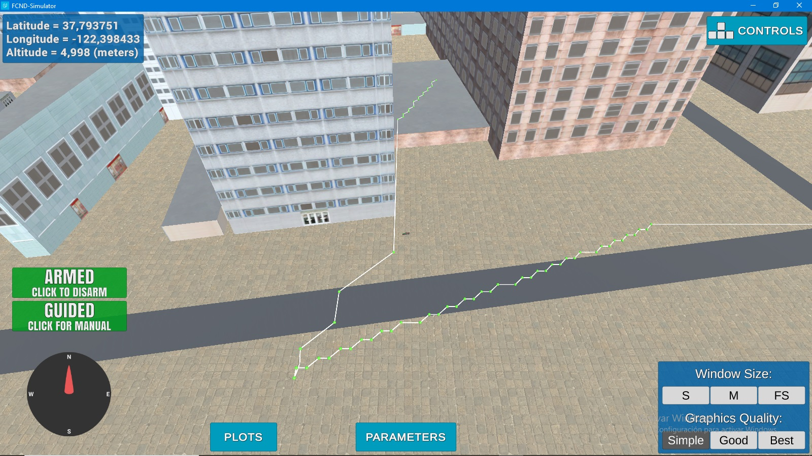

## Project: 3D Motion Planning


---


# Required Steps for a Passing Submission:
1. Load the 2.5D map in the colliders.csv file describing the environment.
2. Discretize the environment into a grid or graph representation.
3. Define the start and goal locations.
4. Perform a search using A* or other search algorithm.
5. Use a collinearity test or ray tracing method (like Bresenham) to remove unnecessary waypoints.
6. Return waypoints in local ECEF coordinates (format for `self.all_waypoints` is [N, E, altitude, heading], where the drone’s start location corresponds to [0, 0, 0, 0].
7. Write it up.
8. Congratulations!  Your Done!

## [Rubric](https://review.udacity.com/#!/rubrics/1534/view) Points
### Here I will consider the rubric points individually and describe how I addressed each point in my implementation.  

---
## Explaination of the Starter Code

### 1. Functionality of what's provided in `motion_planning.py` and `planning_utils.py`
Estos scripts contienen una implementación de planificación básica que incluye ...

**Diferencias entre motion_planning y backyard_flyer**

En ambos archivos se puede observar una estructura casi identica , menos por una funcion , la cual calcula la lista de waypoints optima para llegar de un punto a otro en el mapa , el backyard_flyer solo podia generar un cuadro que previamente le otorgamos nosotros , en cambio el motion_planning nos entrega los waypoints dado un punto de inicio y un punto final , calcula el camino mas corto y nos devuelve una ruta optima.

#### Archivo1: [motion_planning.py](https://github.com/Sergio55Veliz/Vehiculos-no-Tripulados/blob/main/motion_planning.py)
En el archivo motion_planning.py vamos a editar la funcion plan path , en esta parte empearemos leyendo el archivo `colliders.csv` para encontrar `lon0` `lat0` , para despues setearlas como home position, luego obtenemos la posición global con la función `self.global_position` que le pertenece a la clase `Drone`, luego con la función `create_grid()` vamos a crear nuestro espacio de trabajo ademas de obtener el grid inicial del drone. 
Lo siguiente es que con la función `create_grid()` creamos nuestro espacio de trabajo además de obtener el offset, después con la función `getGoal_local_position()`definimos el punto aleatorio de destino.

Ahora, para generar el camino utilizamos el algoritmo A* , después de esto simplificamos el camino con el algoritmo de colinealidad para eliminar los puntos inecesarios de nuestra lista de waypoints (estos algoritmos los encontramos en el archivo [planning_utils.py](https://github.com/Sergio55Veliz/Vehiculos-no-Tripulados/blob/main/planning_utils.py)). Por ultimo enviamos nuestra listra filtrada a los atributos del drone y al simulador para que este los muestre y sea mas facil visualizar lo que esta pasando.


##### Archivo2: [planning_utils.py](https://github.com/Sergio55Veliz/Vehiculos-no-Tripulados/blob/main/planning_utils.py)
Este archivo nos va a proveer de funciones importantes para el proyecto , la cuales utilizaremos en el archivo `motion_planning.py` tendremos la funcion `create_grid`, la cual discretizará nuestro espacio de trabajo , la de valid_actions que validara las acciones de nuestro drone , el algoritmo A* `a_star` que nos retornara el camino mas corto dado una lista de grid , la heuristica y los puntos inciales y finales ademas de esto agregamos las funciones `point` `collinearity_check` y `prune_path` las cuales usaremos para eliminar los puntos intermedios inecesarios en nuestro camino (puntos coolineales).


## Implementing Your Path Planning Algorithm

### 1. Set your global home position
Aquí para el primer vuelo leimos el `colliders.csv` y de su primera línea obtubimos el `lat0`y `lon0`. Estos son usados para setearle el `home_position` al dron. 
```python
#La obtención de lat0 y lon0 está en la línea 126 de motion_planning.py
self.set_home_position(lat0, lon0, 0)
```
¿Pero qué pasa cuando queremos ejecutar por segunda ocasión el código y el dron debe de despejar desde el que era la posición final de la ejecución anterior?, para hacer eso deberíamos de mover el `home_position` a la posición actual. Pero... esto aparentemente se hace de forma automática sin que le añadamos una línea de codigo para ello. Existen dos formas de setear el `home_position` pero no se recomienda utilizarlas ya que al final por alguna razón hacen que el punto de referencia `home_position` se mueva de lugar (si la posicion actual de despegue estaba a *x,y* distancia del centro, añadiendo esas líneas estaría a *2x,2y* de distancia exactamente)
```python
#primera opción para el seteo (linea 150 de motion_planning.py)
self.set_home_as_current_position()
#segunda opcion para el seteo (linea 151 de motion_planning.py)
self.set_home_position(self.global_position[0], self.global_position[1], 0)
```

### 2. Set your current local position
Para esta tarea se usó la funcion `global_to_local`de `udacidrone.frame_utils`. Esta función lo que hace es transformar la latitud y longitud en coordenadas norte y este respectivamente, para luego retornarnos la resta de ellas. Con respecto a la altura ingresada, esta funcion simplemente me retorna la altura del `global_position` multiplicada por -1.
```python
#linea 137 motion_planning.py
local_pos = global_to_local(self.global_position,
                                    global_home=self.global_home)  # Respecto al centro
```
Nota: Es importante que el `global_home` sea el centro del mapa.
### 3. Set grid start position from local position
Para esta parte hay que tener muy en claro que las posiciones locales de los obstaculos que me da el `colliders.csv`no son iguales a las que trabaja el programa (para las matrices), esto porque el `.csv`considera que el centro es el punto *(0,0)*, pero ya que trabajamos con matrices hay que hacerle un ligero desplazamiento a este punto de referencia para que el *(0,0)* quede en la esquina inferior derecha, este desplazamiento es el "offset" que nos entrega la función `create_grid` en `planning_utils.py`, pero hay que considerar que este offset entregado es negativo, por lo que se multiplica por (-1) para que sea un vector de desplazamiento positivo.
Dicho esto podríamos concluir que `grid_star = - offset`. Pero no, ya que ahpi estaríamos ignorando el local_home, si siempre estuvieramos partiendo desde la posición central no importa ya que sus coordenadas son *(0,0)* respecto al centro, pero como habrán situaciones en las que el punto de despegue no será el centro, tenemos que considerar este valor. Por lo que concluimos:
```python
#grid_start = - offset + local_position ... lo que viene siendo lo mismo a...
#           =   centro + local_position
grid_start = (-north_offset + local_pos[0], -east_offset + local_pos[1]) #línea 158
```
Nota: Esta fórmula se toma en cuenta para generar el punto aleatorio `grid_doal` en la función `getGoal_local_position()` *(revise línea 209 y 220)*
### 4. Set grid goal position from geodetic coords
Con la funcion `getGoal_local_position()` ayudándose de `generate_random_localPosition()` definiremos un punto aleatorio y libre de obstaculos para que el drone llegue a ese punto de destino `grid_goal`. De forma general el proceso consiste en generar una posición aleatoria para cada eje con `generate_random_localPosition()`, esta función es llamada dos veces en `getGoal_local_position()` para generar las posiciones aleatorias en el eje *Norte* y *Este*. Cuando se obtiene la posicion aleatoria por eje se valida que esta no esté ni fuera ni en el borde del mapa, caso contrario se manda a generar otra posición aleatoria, esto se lo hace primero para el eje *Norte* y luedo para el *Este*.
Verificado esto, lo que sigue es validar si el punto generado está en un obstáculo *(línea 230)*. Por útilimo se le añadió una restricción de distancia al punto generado, que es que solo puede estar en un radio de 10 a 100m de distancia del punto de partida *(línea 236)*, se decidió añadir esto porque pasado de esa distancia el código genera un error de comunicación con el simulador.

### 5. Modify A* to include diagonal motion (or replace A* altogether)
Al algoritmo A* le añadimos las opciones de movimiento inclinado con costo de sqrt(2)

Para modificar el algoritmo A* hay que modificar 3 cosas: la clase Enum `Action` y las funciones `valid_actions` y `a_star`. 
#####Clase Enum `Action`
Esta clase posee las opciones de dirección que puede tomar el dron para moverse de un nodo a otro, por lo que agregamos las siguientes opciones:
```python
NORTH_WEST = (-1, -1, np.sqrt(2))# ↗
NORTH_EAST = (-1, 1, np.sqrt(2)) # ↖
SOUTH_WEST = (1, -1, np.sqrt(2)) # ↘
SOUTH_EAST = (1, 1, np.sqrt(2))  # ↙
```

##### Función `valid_actions`
En esta funcion se definen las restricciones de movimiento que tiene un nodo en particular. Aquí se define en qué direcciones se puede mover sabiendo si está en el borde del mapa o tiene o no algún obstáculo cerca.
Per para poderse mover en diagonal, por el espacio que ocupa el dron, debería de poder moverse a la cerlda diagonal a la que se dirige como a sus componentes cartesianas; o sea que si se quiere mover al noreste tiene que poder moverse al norte, al este y a la esquina noreste. Sabiendo esto añadimos las siguientes restricciones...

```python
# Validando movimiento diagonal
if Action.NORTH not in valid_actions or Action.EAST not in valid_actions or grid[x + 1, y + 1] == 1:
    valid_actions.remove(Action.NORTH_EAST)
if Action.NORTH not in valid_actions or Action.WEST not in valid_actions or grid[x + 1, y - 1] == 1:
    valid_actions.remove(Action.NORTH_WEST)
if Action.SOUTH not in valid_actions or Action.EAST not in valid_actions or grid[x - 1, y + 1] == 1:
    valid_actions.remove(Action.SOUTH_EAST)
if Action.NORTH not in valid_actions or Action.WEST not in valid_actions or grid[x - 1, y - 1] == 1:
    valid_actions.remove(Action.SOUTH_WEST)
```

##### Función `a_star`
Habiendo ya configurado las direcciones y filtrado las direcciones viables a tomar, solo quedaría elegir cuál de ellas puede ser mejor o "menos costosa" y justo eso es lo que se está modificando en la función `a_star` *(revisar linea 135)*.
La comparación que se hace es verificar si `new_cost < cost_in_branch`, donde `cost_in_branch` es el costo de un movimiento anteriormente guardado en el *branch* y `new_cost` es el costo de otro movimiento diferente. Entonces para cada posible movimiento o dirección viable que puede tomar un nodo se ejecuta este fragmento de código...
```python
if next_node not in visited:  # Evita que retrocedamos o andemos en círculos
    if next_node in branch:#En caso de que ya se haya agregado otro camino para este nodo...
        cost_in_branch = branch[next_node][0]
        if new_cost < cost_in_branch:#Se encarga de elegir el camino menos costoso
            branch[next_node] = (new_cost, current_node, action)
            queue.put((queue_cost, next_node))
    else:
        branch[next_node] = (new_cost, current_node, action)
        queue.put((queue_cost, next_node))

```

### 6. Cull waypoints 

def point(p):
    return np.array([p[0], p[1], 1.]).reshape(1, -1)


def collinearity_check(p1, p2, p3, epsilon=1e-6):
    m = np.concatenate((p1, p2, p3), 0)
    det = np.linalg.det(m)
    return abs(det) < epsilon


def prune_path(actual_path):
    pruned_path = [p for p in actual_path]
    i = 0
    while i < len(pruned_path) - 2:
        p1 = point(pruned_path[i])
        p2 = point(pruned_path[i + 1])
        p3 = point(pruned_path[i + 2])

        if collinearity_check(p1, p2, p3):

            pruned_path.remove(pruned_path[i + 1])
        else:
            i += 1
    return pruned_path
Para este punto vamos a usar el algoritmo de colinearidad para de esta forma eliminar los puntos intermedios que son inecesarios recorrer , primero validaremos que cada tres puntos no sean colineales con un marger de error epsilon, luego si los tres puntos so colineales se elimina el de enmedio P2. 
Usaremos esta funcion para agregarla a prune_path(actual_path) y de esta forma analizar el waypoint y eliminar los puntos inecesarios y de esta forma devolver el waypoint optimizado.


## Execute the flight

### Resultado de Simulación:
##### Simulación 1
Se movió el dron a un punto aleatorio


##### Simulación 2
En esta 2da simulación podemos observar que se logró hacer que el dron se mueva desde el "punto final" de la *Simulación 1* hasta un segundo punto aleatorio.


### Double check that you've met specifications for each of the [rubric](https://review.udacity.com/#!/rubrics/1534/view) points.
  
# Extra Challenges: Real World Planning

For an extra challenge, consider implementing some of the techniques described in the "Real World Planning" lesson. You could try implementing a vehicle model to take dynamic constraints into account, or implement a replanning method to invoke if you get off course or encounter unexpected obstacles.


